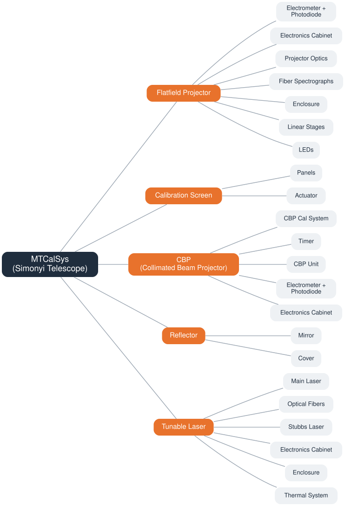
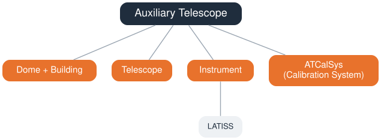

# Rubin Calibration System (CalSys) Overview

## Introduction

This technical note describes the hardware and software that make up the Rubin Calibration System (CalSys). It is intended as a reference for anyone working with CalSys hardware, its control software, or running test cases to produce calibration products, and as an entry point to the more detailed design documents for each subsystem. Throughout this document, there are links to other tech notes that go into much more detail for each subsystem.

The Rubin CalSys comprises all of the hardware and software needed to provide the illumination patterns required to produce the calibration products needed to achieve Rubin's science goals. The Calibration pipeline, which comprises the software packages needed to build the calibration products from CalSys data, can be found at [lsst.cp.pipe](https://pipelines.lsst.io/modules/lsst.cp.pipe/index.html).

The Rubin Calibration System has three main components:

1. **Auxiliary Telescope** — measures the atmosphere above Cerro Pachón, right near Rubin on "calibration hill".
2. **Flatfield System** — delivers white-light and monochromatic flat fields.
3. **Collimated Beam Projector (CBP)** — sends a collimated beam of light directly at the Rubin optical system (Telescope + Camera) without the scattered light associated with flatfields.

Together with Instrument Signal Removal (ISR) and FGCM, developed by the Rubin Data Management (DM) team, these subsystems allow us to meet our required calibration needs. The subsections below (MTCalSys and ATCalSys) break each of these components down into their constituent hardware.

## MTCalSys

MTCalSys is the calibration hardware associated with the Simonyi Survey Telescope. It breaks down into two functional groups described in the Overview: the **Flatfield System** (Flatfield Projector, Calibration Screen, and Reflector) and the **Collimated Beam Projector system** (the CBP itself and its Tunable Laser light source).

**Flatfield System**

- **Flatfield Projector** ([TSTN-060](https://tstn-060.lsst.io)) - projects white-light and monochromatic flat fields onto the Calibration Screen, illuminating the Camera's full field of view. Includes the projector optics, LED sources, fiber spectrographs, linear stages, and the electrometer + photodiode pair used to monitor the illumination in real time.
- **Calibration Screen** ([TSTN-057](https://tstn-057.lsst.io)) - the large diffusing screen mounted in the dome that the Flatfield Projector illuminates; its panels and actuator allow it to be deployed into and stowed out of the beam.
- **Reflector** ([TSTN-049](https://tstn-049.lsst.io)) - aspheric mirror mounted on the top of the camera. When the TMA is aligned with the flatfield projector, it directs the illumination onto the calibration screen.

**Collimated Beam Projector (CBP) system**

- **CBP** ([TSTN-067](https://tstn-067.lsst.io)) - projects a smaller collimated beam through the full optical system (telescope + camera) to measure system throughput directly, without the scattered-light contribution present in screen flats. Includes the CBP unit itself, its calibration system, timer, electrometer + photodiode, and electronics cabinet.
- **Tunable Laser** ([TSTN-065](https://tstn-065.lsst.io)) - the wavelength-tunable light source that feeds both the CBP and the flatfield projector. Includes the laser, optical fibers, thermal system, and supporting electronics and enclosure.

## ATCalSys

ATCalSys is the calibration hardware associated with the Auxiliary Telescope, which is used to measure the atmospheric transmission above Cerro Pachón. In some sense, the whole Auxiliary Telescope is part of the ATCalSys, however, that term is usually reserved for the hardware used to take flat-field images with LATISS. 

Many details of the Auxiliary Telescope can be found in [Docushare](https://docushare.lsst.org/docushare/dsweb/View/Collection-273).

- **Telescope** — the Auxiliary Telescope is a 1.2m Ritchey-Chretien, getting a second home after its life as Calypso on Kitt Peak. 
- **Dome + Building** — the building infrastructure has a 9.3m diameter and was built by Ash-Dome
- **Instrument (LATISS)** — LSST Atmospheric Transmission Imager and Slitless Spectrograph, used to obtain imaging and slitless spectroscopy of standard stars.
- **ATCalSys (Calibration System)** ([TSTN-032](https://tstn-032.lsst.io)) - the hardware used to illuminate the flat-field screen in the telescope for calibration of LATISS and the telescope.

## Operations Concept

The AuxTel is operated every night the sky is clear enough, measuring the spectra of standard stars throughout the night. With this data, the atmospheric transmission is measured at a range of times and airmasses . During the weekends, calibrations are run.

At the Simonyi Telescope, calibrations are taken on several time scales:
* **Daily**:
    * Daily Checkout is performed during the daytime to confirm the operation of the Reflector, temperature sensors for the Laser and CBP (ESS), the Electrometer, FiberSpectrograph, and Projector and LEDs. The results of this test is reported in [TimeSquare](https://usdf-rsp.slac.stanford.edu/times-square/github/lsst-so/reports-performance-summary/sst/calsys/Daily_CalSys-TimeSquare)
    * During standard observing nights, either LSSTCam Daily Calibrations or LSSTCam Minimal Daily Calibrations is taken, which takes whitelight flats. These are done at the end of the night, in the early morning.
* **Weekly**:
    * Laser and CBP checkout should be done weekly to confirm general operation
* **Intermittent**:
    * When there is bad weather or any other reason why we can't go on sky but the camera is working, we will take longer calibration sequences.
    * There may be other times that we push for additional calibrations, like when major changes to the camera or its control software have been made.
    * These include:
        * Whitelight Flats: 20+ exposures for each installed filters with LEDs
        * PTC: These tests take all night, reaching 750 pairs of exposures with differing exposure times
        * Monochromatic Flats: This uses the TunableLaser to step through a range of wavelengths covering a given filter, with an exposure at each.
        * CBP Filter sweeps: Similar to Monochromatic Flats, but using the CBP. May be several pointings of the TMA/CBP.

## Test Cases and Calibration Products
The observing documentation has excellent descriptions of all of the main [Calibration Blocks](https://rubinobs.atlassian.net/wiki/spaces/OOD/folder/1030128743/Calibration+Blocks).

These test blocks enable us to collect the necessary calibration products:
* Single LED Flats
* PTC Curves
* CBP Throughput Curves
* Monochromatic Flats
* Electrometer measurements accompanying the flats and throughput curves above
* Fiber Spectrograph measurements of LEDs and the Tunable Laser

## Glossary

| Term | Definition |
|---|---|
| CalSys | Rubin Calibration System |
| MTCalSys | Main Telescope (Simonyi Survey Telescope) Calibration System |
| ATCalSys | Auxiliary Telescope Calibration System |
| CBP | Collimated Beam Projector |
| LATISS | LSST Atmospheric Transmission Imager and Slitless Spectrograph |
| FGCM | Forward Global Calibration Method |
| ISR | Instrument Signal Removal |
| TMA | Telescope Mount Assembly |
| PTC | Photon Transfer Curve | 
| ESS | Environmental Sensor System |
